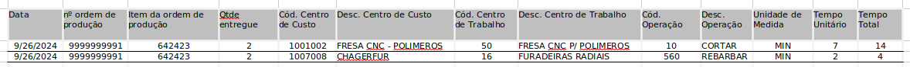

Titulo: Relatório de Custos Operacionais
Descrição: ideia é saber quais ordens estão gerando os tempos que posteriormente serem para gerar a taxa hora e auditar pare ver se temos alguns roteiro que não estão gerando as horas porque não estão de corretamente ligados. Acreditamos que tem horas faltantes, mas de quais itens/ordens....

Obs.: Todas as informações são geradas do relatório FPRD0317, contudo ele é gerado em xml , porém como o relatório não traz  os centro de trabalho e nem centro de custo, o usuário  gerou estas informação a parte e fez um procv. Logo estas informações tem que fechar o relatório 2. 