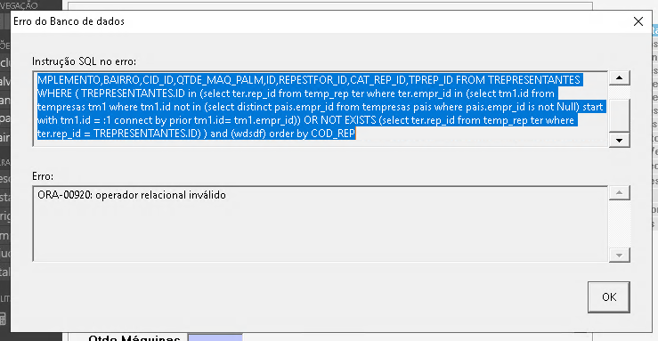

## Lista de Empresas e atendimentos FOCCO - Modelo Vencedor

#   Tratamento visualização DATA →
    TO_CHAR(TORDENS.DT_EMISSAO,'DD/MM/RRRR')

# Filtro de data inicio e data Final →
    TRUNC(SYSDATE) BETWEEN TCAD_EST_ITE.DT_INI AND TCAD_EST_ITE.DT_FIM

# Switch → 
    CASE WHEN THEN ELSE END
    CASE TEMPRESAS.ID WHEN 1 THEN 'MATRIZ'
    WHEN 2 THEN 'BENTO'
    WHEN 3 THEN 'SANTA CRUZ'
    ELSE 'POA' END

# Calculo de MESES ou ANOS →
    TRUNC(ADD_MONTHS(SYSDATE,-60))

# Macete para ver a estrutura do cadastro de dados no focco
    Entrar em uma tela de cadastro
    press F7 digite ':a', pode ser qualquer letra depois dos dois pontos
    press F8 digite 'asd', pode ser qualquer texto para dar um erro
    vai apresentar a tela de erro clica em sair
    press SHIFT + F1, será  apresentado a tela com a estrutura do erro

<!-- Exemplo -->
    SELECT ROWID,COD_REP,DESCRICAO,NOME_FAN,DT_CAD,CORE,CNPJ,CPF,CEP,ENDERECO,LOGRADOURO,NR_ENDERECO,COMPLEMENTO,BAIRRO,CID_ID,QTDE_MAQ_PALM,ID,REPESTFOR_ID,CAT_REP_ID,TPREP_ID FROM TREPRESENTANTES WHERE ( TREPRESENTANTES.ID in (select ter.rep_id from temp_rep ter where ter.empr_id in (select tm1.id from tempresas tm1 where tm1.id not in (select distinct pais.empr_id from tempresas pais where pais.empr_id is not Null) start with tm1.id = :1 connect by prior tm1.id= tm1.empr_id)) OR NOT EXISTS (select ter.rep_id from temp_rep ter where ter.rep_id = TREPRESENTANTES.ID) ) and (wdsdf) order by COD_REP

